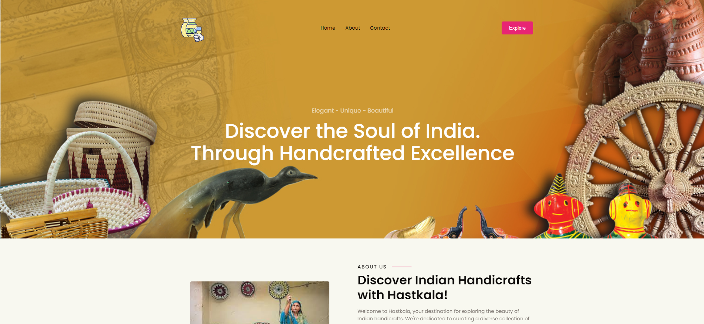
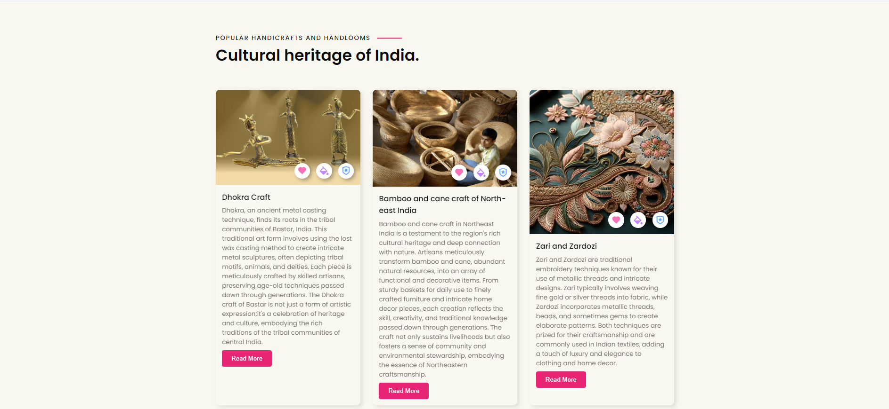
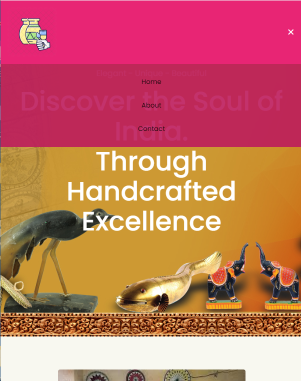

# Hastkala

Welcome to Hastkala, your destination for exploring the beauty of various Indian handicrafts and handlooms.

## Description

Hastkala is a curated collection showcasing the rich diversity of Indian handicrafts and handlooms. From intricate lace crochet to vibrant Pochampalli Ikat, this repository aims to celebrate the cultural heritage and artistic excellence embodied in each unique creation.

## Features

- **Curated Collection**: Explore a diverse range of Indian handicrafts and handlooms.
- **Interactive Design**: Engage with an intuitive and visually appealing interface.
- **Responsive Layout**: Enjoy seamless browsing across different devices.

## Preview

## Demo
https://hast-kalaa.vercel.app/
